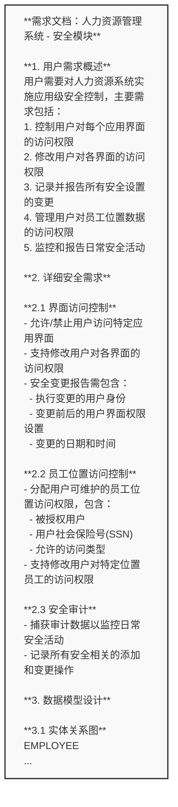

## 4.1 数据集构建 (Dataset Construction)

由于公共领域缺乏高质量的软件功能点标注数据，且现有数据往往难以满足工业级评估的严谨性要求，本研究构建了一套基于国际标准案例的专用评测数据集。该数据集的构建严格遵循《IFPUG 计数实践手册 (CPM) 4.3.1》指导原则，旨在通过标准的改编与专家的双重校验，确保评估基准的权威性与客观性。

### 4.1.1 数据来源与改编机制 (Data Source & Adaptation)

数据集的核心语料源自 IFPUG CPM Release 4.1 的官方教学案例。为了防止大语言模型在预训练阶段接触过这些公开案例从而导致“数据泄露”，我们实施了一套系统的深度脱敏与重构流程。首先，我们将原始的英文案例**翻译**为中文，并对特定术语进行了本地化标准化处理。随后，我们进行了**场景重构**，将原有的通用描述映射至具象化的企业级应用场景（如集团级人力资源中台、审计合规管理系统等），以增加上下文的丰富度。在这一过程中，我们严格遵循**语义保留**原则，确保关于数据边界、维护流程及引用关系的逻辑结构未被破坏，从而保证功能点判定的事实依据（Logical Facts）不变。最后，为了模拟真实工业环境的复杂性，我们在简洁的原始描述中**注入了干扰信息**，如冗余的非功能性需求描述和复杂的字段定义，显著提升了任务的挑战性。

### 4.1.2 数据标注与真值确立 (Annotation & Ground Truth)

为了确保数据集 Ground Truth（真值）的绝对准确性，本研究采用了一种 Expert-in-the-Loop 的双重校验机制。初始真值直接继承自 CPM 4.1 的官方标准答案。随后，我们邀请了持有 **CFPS (Certified Function Point Specialist)** 认证的资深专家对改编后的文档进行独立评审。评审的核心在于确认改编后的需求描述是否依然严格对应原有的功能分类标准。仅当专家组的评审结果与官方标准答案达成完全一致时，该样本才会被最终收录。这种机制有效消除了人工改编可能引入的歧义。

### 4.1.3 数据集组织架构 (Dataset Organization)

为了全面且分层地评估自动化框架的性能，我们将数据集划分为“判别（Judgment）”与“识别（Selection）”两个梯度的四个子任务集。每一个子集都针对特定的评估能力维度设计了标准化的数据结构。

**判别任务**（包含 ILF 判别与 EIF 判别）侧重于考察模型对功能点概念的理解能力。在该类任务中，模型接收上下文需求文本（`requirement_text`）以及一个待判定的候选实体（`candidate_ilf` 或 `candidate_eif`），需要输出一个二分类标签（True/False），以判定该实体是否符合 ILF 的“内部维护”或 EIF 的“外部引用”定义。这主要评估模型在给定目标下的合规性判断精度。

**识别任务**（包含 ILF 识别与 EIF 识别）则代表了更高阶的端到端评估挑战。模型不仅需要深入理解非结构化的需求描述（`requirement_text`），还必须在无明确候选提示的情况下，主动**提取（Extract）**出所有潜在的数据实体，并同步**判定（Judge）**其是否满足复杂的功能点规则，最终输出一个完整的功能点列表（`true_ilf` 或 `true_eif`）。这类任务能够同时评估模型的召回能力（是否找全）与精确能力（是否判对），是检验自动化框架实战能力的关键试金石。

**表 4-1：功能点评估任务数据集结构一览**

| 任务类型 | 子任务名称 | 任务难度 | 目标描述 | 关键字段定义 |
| :--- | :--- | :--- | :--- | :--- |
| **判别任务** (Judgment) | **ILF 判别** | 低 | 给定需求全文与候选实体，判定是否符合 ILF 定义 | `requirement_text`: 需求全文 `candidate_ilf`: 待判定实体 `ground_truth`: T/F 标签 |
| | **EIF 判别** | 低 | 给定需求全文与候选实体，判定是否为 EIF (引用数据) | `requirement_text`: 需求全文 `candidate_eif`: 待判定实体 `ground_truth`: T/F 标签 |
| **识别任务** (Selection) | **ILF 识别** | 高 | 从需求全文中**提取**实体并同步**判定**是否为 ILF | `requirement_text`: 需求全文 `true_ilf`: 完整 ILF 列表 |
| | **EIF 识别** | 高 | 从需求全文中**提取**实体并同步**判定**是否为 EIF | `requirement_text`: 需求全文 `true_eif`: 完整 EIF 列表 |

### 4.1.4 数据集样例 (Dataset Samples)

为了直观地展示数据集的构成，下表选取了 EIF 判别与 ILF 识别任务的典型样本。EIF 判别任务的输入包含需求描述与待判定的候选实体，模型需判断其是否为外部接口文件（EIF）；ILF 识别任务则要求模型在无提示的情况下，从需求文档中提取出所有符合内部逻辑文件（ILF）定义的实体。

**表 4-2：判别与识别任务数据集样本示例**

| ID | 任务类型 | 待判定实体 / 目标列表 | 需求片段 (Requirement Snippet) | 真值 (Ground Truth) |
| :--- | :--- | :--- | :--- | :--- |
| 1 | **EIF 判别** (Judgment) | **转换信息 (汇率信息)** | **需求文档：人力资源系统与货币系统集成** ... 本需求文档描述了人力资源（HR）系统与货币（Currency）系统之间的集成需求，旨在实现时薪制员工的薪酬计算与货币转换功能。 | **True** |
| 2 | **ILF 识别** (Selection) | **Screen security** **Employee security** | **需求文档：人力资源管理系统 - 安全模块** ... 用户需要对人力资源系统实施应用级安全控制，主要需求包括：1. 控制用户对每个应用界面的访问权限... | **Screen security** **Employee security** |

为了更具体地展示识别任务的输入复杂度，图 4-2 展示了 ILF 识别任务（Doc ID 1）的完整非结构化需求文档。

**图 4-2：非结构化需求文档输入示例（Screen Security 任务）**

