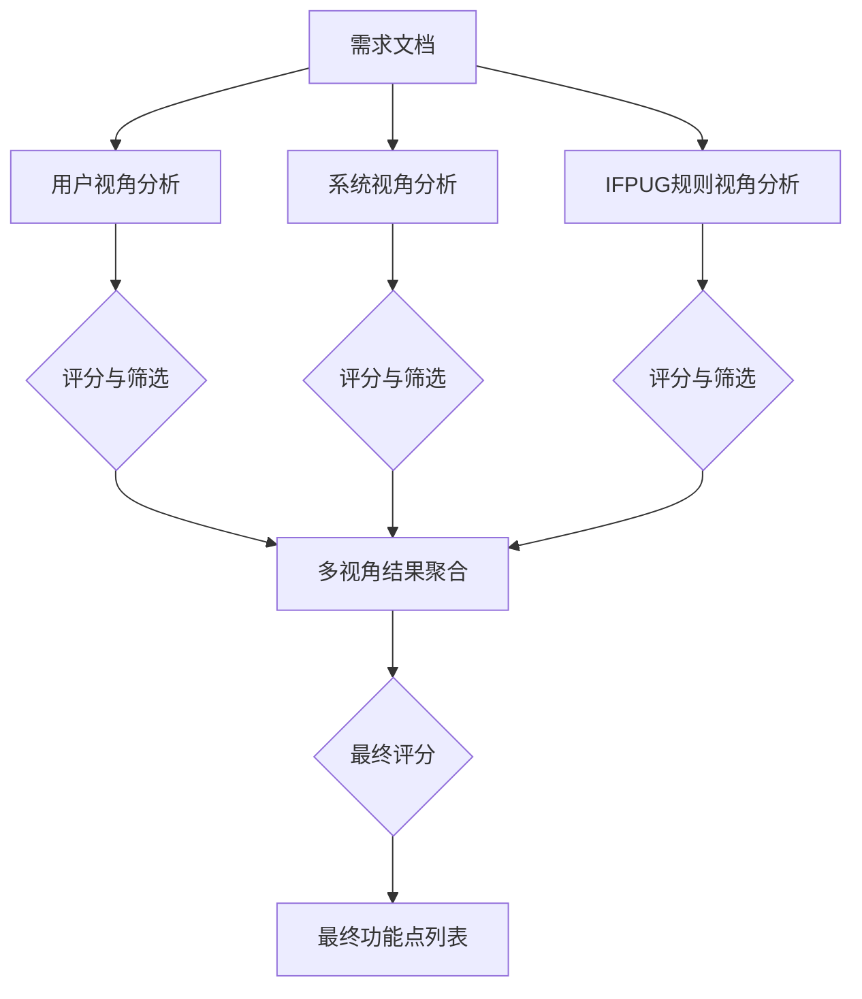

# 3. 方法论 (Methodology)

本章详细介绍了基于思维图（Graph of Thoughts, GoT）的自动化功能点评估框架。我们将传统的 IFPUG 功能点分析过程建模为图结构，通过多视角协同推理和语义一致性验证，提高识别的准确性和鲁棒性。

## 3.1 总体框架 (Overall Framework)

传统的自动化功能点识别往往采用线性的思维链（Chain of Thought, CoT）或简单的树状搜索（Tree of Thoughts, ToT），难以处理需要综合多方面证据的复杂逻辑判断。本文提出的 GoT 框架将推理过程构建为一个有向图，包含以下核心特征：

1.  **多视角推理 (Multi-Perspective Reasoning)**：模拟人类专家的思维方式，分别从用户视角、系统视角和规则视角独立分析。
2.  **动态聚合 (Dynamic Aggregation)**：在推理的中间阶段对不同视角的结论进行合并、冲突消解和一致性校验。
3.  **语义评估 (Semantic Evaluation)**：在结果验证阶段引入基于 LLM 的语义相似度匹配，解决功能点命名不一致的问题。

## 3.2 图结构设计 (Graph Structure Design)

针对 ILF（内部逻辑文件）和 EIF（外部接口文件）的识别任务，我们设计了特定的 GoT 拓扑结构。该结构包含三个主要阶段：并行分析阶段、合并阶段和最终决策阶段。

### 3.2.1 拓扑结构
我们的 GoT 结构如图 3.1 所示（示意图描述）：



### 3.2.2 核心操作 (Core Operations)
我们在框架中定义了以下关键操作算子：

1.  **Generate (生成操作)**：
    *   **Phase 1 (Analysis)**：输入需求文档，根据特定视角（User/System/Rule）生成候选功能点列表及其理由。
    *   **Phase 2 (Merge)**：输入前一阶段三个视角的优选结果，生成合并后的唯一功能点列表。此步骤包含去重、冲突解决逻辑。

2.  **Score (评分操作)**：
    *   对每个生成的思维状态（Thought State）进行质量打分。
    *   评分标准包括：识别结果的完整性、理由的逻辑性以及与 IFPUG 规则的符合度。
    *   **评分函数示例**：使用 LLM 自身作为评估器，对生成的分析报告进行打分（0-10分），只有高分路径会被保留。

3.  **KeepBestN (优选操作)**：
    *   在每一层级保留得分最高的 $N$ 个思维路径（本实验中 $N=1$），剪枝低质量的推理分支，确保后续聚合的质量。

### 3.2.3 详细图结构流程 (Detailed Graph Workflow)
1.  **初始化**：系统接收原始需求文档文本。
2.  **分支生成**：系统并发启动三个 `Generate` 操作，分别加载不同的 Perspective Prompt。
3.  **局部优化**：每个分支后接 `Score` 和 `KeepBestN` 操作，确保每个视角产生的分析结果都是高质量的。
4.  **全局聚合**：三个分支的输出作为 Context 传入 `Merge` 节点的 `Generate` 操作。
5.  **最终验证**：聚合后的结果再次经过评分，输出最终的 JSON 格式列表。

## 3.3 多视角协同分析 (Multi-Perspective Analysis)

为了模拟专家评审过程，我们为 LLM 设计了三个独立的分析角色（Persona），通过提示词工程（Prompt Engineering）引导其关注不同侧面。

### 3.3.1 用户视角 (User Perspective)
*   **关注点**：业务价值和可识别性。
*   **推理逻辑**：识别用户能够理解、感知并从中获益的数据组。重点判断数据是否逻辑独立，是否不仅是技术实现细节。
*   **Prompt 设计**：
    ```text
    你是一个IFPUG功能点分析专家。请从用户视角分析需求文档，识别出所有可能的ILF/EIF功能点。
    
    用户视角 - 关注：
    - 哪些数据组满足完整的业务需求
    - 哪些数据组能独立存在并有实际业务价值
    - 哪些数据组用户可以直接识别
    ```

### 3.3.2 系统视角 (System Perspective)
*   **关注点**：数据维护边界和操作类型。
*   **推理逻辑**：
    *   对于 **ILF**：关注数据是否在应用边界内维护，是否有完整的 CRUD（增删改查）流程。
    *   对于 **EIF**：关注数据是否物理/逻辑上位于应用边界之外，是否仅被引用（只读）而不被维护。
*   **Prompt 设计**：
    ```text
    系统视角 - 关注：
    - 哪些数据有完整的CRUD操作流程（针对ILF）
    - 哪些数据存在于应用边界之外（针对EIF）
    - 应用是否仅引用（读取）该数据，不进行增删改操作
    ```

### 3.3.3 IFPUG 规则视角 (IFPUG Rules Perspective)
*   **关注点**：定义符合度和排除条件。
*   **推理逻辑**：严格对照《IFPUG 计数实践手册》中的定义进行核查，排除临时文件、中间文件、索引文件等非功能点实体。
*   **Prompt 设计**：
    ```text
    IFPUG规则视角 - 关注：
    - 哪些数据实体满足ILF/EIF的所有必要条件
    - 需要排除哪些不符合条件的候选项（如临时数据、代码表等）
    - 是否符合IFPUG的最佳实践
    ```

### 3.3.4 结果聚合与冲突解决 (Aggregation & Conflict Resolution)
在聚合节点（Merge Node），LLM 接收来自上述三个视角的分析报告。聚合逻辑如下：
1.  **一致性检查**：优先保留三个视角共同识别出的功能点。
2.  **多数表决**：对于仅有两个视角识别出的功能点，检查其理由是否充分。
3.  **争议仲裁**：对于仅有一个视角识别出的功能点，将其标记为“争议项”，并结合排除条件（如是否为临时数据）进行二次判断。

**Merge Prompt 示例**：
```text
请综合以下三个视角的分析结果，得出最终的功能点列表。

[分析要求]
1. 汇总三个视角识别的所有功能点
2. 对每个功能点，检查三个视角的一致性
3. 去除重复项和明显不符合条件的项
4. 对有争议的功能点进行深入分析
```

## 3.4 评估指标与语义匹配 (Evaluation Metrics & Semantic Matching)

为了客观评估自动化方法的性能，我们构建了一套包含语义理解的评估指标体系。

### 3.4.1 基础指标
采用信息检索领域的标准指标：
*   **Precision (精确率)**：预测正确的功能点数 / 预测总数。
*   **Recall (召回率)**：预测正确的功能点数 / 真实功能点总数。
*   **F1 Score**：精确率和召回率的调和平均。

### 3.4.2 基于 LLM 的语义匹配 (LLM-based Semantic Matching)
在实际场景中，模型提取的功能点名称可能与人工标注的标准答案（Ground Truth）存在字面差异（例如“用户信息” vs “用户档案”）。传统的字符串精确匹配会导致评分过低。为此，我们引入了语义相似度匹配机制：

1.  **精确匹配 (Exact Match)**：首先进行标准化（小写、去空格）的字符串比对。
2.  **语义匹配 (Semantic Match)**：对于未命中的项，调用 LLM 判断预测词与标注词的语义一致性。
    *   **输入**：预测名称、标注名称。
    *   **Prompt**：
      ```text
      请判断以下两个功能点名称是否指代同一个功能点：
      功能点1: {name1}
      功能点2: {name2}
      
      请直接回答相似度分数（0.0到1.0之间的小数）。
      ```
    *   **阈值**：仅当 LLM 判定相似度分数 $> 0.7$ 时，视为正确匹配。

该机制显著提高了评估结果的合理性，能够通过 `Fuzzy Score` 量化模型在语义理解层面的表现。

## 3.5 案例分析 (Case Study)

为了更直观地展示 GoT 框架的工作流程，本节以一个典型的“人力资源管理系统”中的“职位信息”识别为例进行说明。

### 3.5.1 输入需求
> **需求片段**：系统需要从集团主数据系统同步“职位信息”，包括职位编码、职位名称、职级等。本地系统只能查看这些信息，不能修改。如果有新的职位，需要在集团系统中添加。用户可以在本系统中查询职位详情。

### 3.5.2 多视角分析过程

#### **(1) 用户视角分析**
*   **分析**：用户在系统中需要查询职位详情，职位信息对业务流程（如招聘、定级）至关重要，且是一个独立完整的数据组。
*   **结论**：识别为功能点。

#### **(2) 系统视角分析**
*   **分析**：根据需求，“职位信息”从集团主数据系统同步，本地“不能修改”，只能“查看”。这意味着它位于当前应用边界之外（由集团系统维护），且在本地是只读引用。
*   **结论**：识别为 **EIF**（外部接口文件）。

#### **(3) IFPUG 规则视角分析**
*   **分析**：
    1.  逻辑独立且用户可识别？是。
    2.  被引用但位于边界外？是（集团系统）。
    3.  不维护（只读）？是（明确说明不能修改）。
*   **结论**：完全符合 EIF 的三个必要条件。识别为 **EIF**。

### 3.5.3 聚合与输出
*   **聚合逻辑**：三个视角均识别出该功能点，且系统视角和规则视角均明确其为 EIF（而非 ILF）。
*   **最终输出**：
    ```json
    {
      "最终功能点列表": ["职位信息"],
      "类型": "EIF",
      "理由": "数据源于外部集团系统，本地只读引用，且用户可识别。"
    }
    ```

### 3.5.4 错误修正示例
假设系统视角误判其为 ILF（忽略了“不能修改”的描述）。
*   **用户视角**：识别为功能点。
*   **系统视角**：识别为 ILF（误判）。
*   **规则视角**：识别为 EIF（依据“不能修改”规则）。
*   **聚合阶段**：Merge 节点发现冲突（ILF vs EIF）。Prompt 引导模型检查“维护”属性。由于规则视角明确指出了“只读”条件，聚合模型修正系统视角的错误，最终判定为 EIF。这是 GoT 相比单链推理（CoT）的显著优势。

## 3.6 实验配置 (Experimental Setup)

*   **模型选择**：主要实验使用 `gpt-3.5-turbo` 和 `DeepSeek` 模型。
*   **参数设置**：
    *   Temperature: 0.7（用于生成多样化解释），0.0（用于最终决策）。
    *   Token Limit: max 2000 tokens per response.
*   **数据预处理**：对需求文档进行分段清洗，去除与功能点无关的格式字符。
