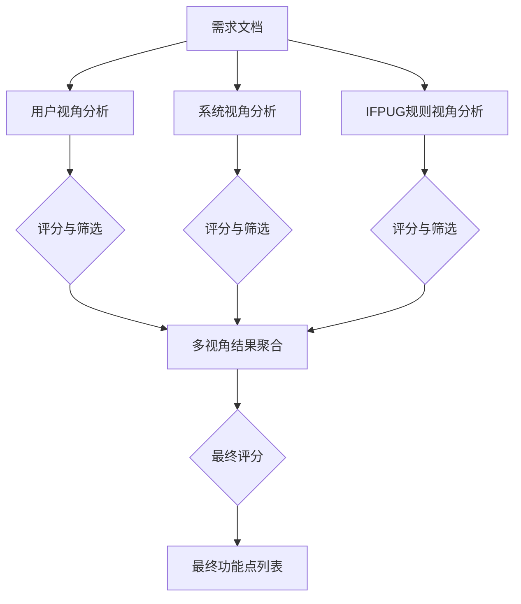

# 3. 方法论 (Methodology)

本章详细介绍了基于思维图（Graph of Thoughts, GoT）的自动化功能点评估框架。为了全面评估所提方法的有效性，我们不仅设计了特定的 GoT 拓扑结构，还实现了 Input-Output (IO)、Chain of Thought (CoT) 和 Tree of Thoughts (ToT) 三种主流提示工程方法作为对比基准。

## 3.1 总体框架 (Overall Framework)

传统的自动化功能点识别往往采用线性的思维链或简单的树状搜索，难以处理需要综合多方面证据的复杂逻辑判断。本文提出的 GoT 框架将推理过程构建为一个有向图，通过多视角协同推理、动态聚合和语义评估，显著提升了复杂需求分析的准确性。

## 3.2 对比基准方法实现 (Implementation of Baseline Methods)

为了验证 GoT 框架在功能点评估任务中的优势，我们在实验中严格按照相同的环境和模型配置，实现了三种基准方法：IO、CoT 和 ToT。这些方法代表了当前大语言模型在复杂推理任务上的不同能力层级。

### 3.2.1 Input-Output (IO) 标准提示
IO 方法代表了 LLM 的零样本（Zero-Shot）推理能力。我们不提供任何中间推理步骤的引导，直接将需求文档输入模型，要求其根据 IFPUG 定义输出功能点列表。

*   **实现逻辑**：`Input(需求) -> LLM -> Output(功能点列表)`
*   **Prompt 结构**：
    ```text
    你是一个IFPUG功能点分析专家。请分析给定的需求文档，识别出其中所有可能的ILF/EIF功能点。
    [需求文档内容]
    **【重要】请严格按照以下格式输出：**
    功能点列表：[功能点1, 功能点2]
    ```
*   **局限性预期**：由于缺乏推理过程，模型容易遗漏隐性功能点或产生幻觉（Hallucination）。

### 3.2.2 Chain of Thought (CoT) 思维链
CoT 方法通过显式地要求模型输出“思考过程”，激发模型的逻辑推理能力。在功能点识别中，我们引导模型遵循“识别实体 -> 规则验证 -> 得出结论”的线性步骤。

*   **实现逻辑**：`Input -> Thought Process -> Conclusion`
*   **Prompt 设计**：
    > “请按照以下步骤进行分析：
    > 1. 识别需求文档中提到的所有外部数据源/接口。
    > 2. 对每个外部数据源，判断是否逻辑上独立且用户可识别。
    > 3. 判断是否不由当前应用进行维护（即只读）。
    > 4. 根据以上分析，列出所有满足条件的功能点。”

*   **优势与不足**：相比 IO 方法，CoT 能显著减少逻辑错误。但由于其单链条特性，一旦中间某一步骤出错（例如第一步漏掉了某个实体），后续步骤无法自我纠正。

### 3.2.3 Tree of Thoughts (ToT) 思维树
ToT 方法引入了“探索”和“回溯”机制。在我们的实现中，ToT 采用了 **“生成 -> 评分 -> 优选 -> 改进”** 的迭代过程。

*   **实现架构**：
    1.  **初步生成**：模型首先快速扫描文档，生成初步的候选列表。
    2.  **自我反思与评分**：模型对初步结果进行自我评估，检查是否有遗漏或误判。
    3.  **迭代改进**：保留评分较高的路径，要求模型基于上一轮的反思结果进行修正（Improvement）。
*   **Prompt 示例**：
    > “基于之前的分析结果进行改进：
    > 之前识别的功能点：{current_answer}
    > 请检查是否有遗漏的 EIF 功能点，或者是否有误判的非 EIF 功能点（例如内部数据）。重新验证三要素，并给出改进后的列表。”
*   **特点**：ToT 具有一定的自我纠错能力，但仍然缺乏多视角的交叉验证，容易陷入单一维度的思维定势。

## 3.3 Graph of Thoughts (GoT) 图结构设计

针对 ILF 和 EIF 识别任务的高复杂性，我们设计了特定的 GoT 拓扑结构，旨在通过多视角并发推理和结构化聚合来超越上述基准方法。该结构包含三个主要阶段：并行分析阶段、合并阶段和最终决策阶段。

### 3.3.1 拓扑结构
我们的 GoT 结构如图 3.1 所示：



### 3.3.2 核心操作算子 (Core Operations)
我们在框架中定义了以下关键操作算子：

1.  **Generate (生成操作)**：
    *   **Phase 1 (Analysis)**：并发启动三个 `Generate` 操作，分别加载用户、系统、规则三个视角的 Perspective Prompt。每个操作生成该视角下的独立分析报告。
    *   **Phase 2 (Merge)**：输入三个视角的优选结果，生成合并后的唯一功能点列表。此步骤包含去重、冲突解决逻辑。

2.  **Score (评分操作)**：
    *   对每个生成的思维状态进行质量打分（0-10分）。评分函数既可以使用 LLM 自我评估，也可以结合启发式规则。
    *   本实验中，只有高质量的推理路径才能进入下一阶段，低质量分支被剪枝。

3.  **KeepBestN (优选操作)**：
    *   在每一层级保留得分最高的 $N$ 个思维路径（本实验中 $N=1$），确保计算资源集中在最有潜力的推理方向上。

## 3.4 多视角协同分析机制 (Multi-Perspective Mechanism)

GoT 的核心优势在于模拟人类专家组的“独立评审-集中讨论”模式。

### 3.4.1 用户视角 (User Perspective)
*   **关注点**：业务价值和可识别性。
*   **推理逻辑**：识别用户能够理解、感知并从中获益的数据组。重点判断数据是否逻辑独立，而非仅仅是数据库表或技术参数。
*   **Prompt**：
    ```text
    用户视角 - 关注：
    - 哪些数据组满足完整的业务需求
    - 哪些数据组能独立存在并有实际业务价值
    - 哪些数据组用户可以直接识别
    ```

### 3.4.2 系统视角 (System Perspective)
*   **关注点**：数据维护边界和操作类型。
*   **推理逻辑**：
    *   **ILF**：关注数据是否有完整的 CRUD 流程且在应用边界内维护。
    *   **EIF**：关注数据是否仅被引用（只读）且维护权在外部系统。
*   **Prompt**：
    ```text
    系统视角 - 关注：
    - 哪些数据有完整的CRUD操作流程（针对ILF）
    - 哪些数据存在于应用边界之外（针对EIF）
    - 应用是否仅引用（读取）该数据，不进行增删改操作
    ```

### 3.4.3 IFPUG 规则视角 (IFPUG Rules Perspective)
*   **关注点**：定义符合度和排除条件。
*   **推理逻辑**：严格对照《IFPUG 计数实践手册》中的定义，排除临时文件、中间文件、索引文件等非功能点实体，确保计数合规。
*   **Prompt**：
    ```text
    IFPUG规则视角 - 关注：
    - 哪些数据实体满足ILF/EIF的所有必要条件
    - 需要排除哪些不符合条件的候选项（如临时数据）
    - 是否符合IFPUG的最佳实践
    ```

### 3.4.4 结果聚合与冲突解决 (Aggregation & Conflict Resolution)
在聚合节点（Merge Node），LLM 充当“主审”角色，接收来自上述三个视角的分析报告。聚合逻辑如下：
1.  **强一致性保留**：三个视角均识别出的功能点直接保留。
2.  **弱一致性校验**：仅两个视角识别出的，通过多数表决机制保留，但需简要说明理由。
3.  **冲突仲裁**：仅一个视角识别出的功能点被标记为“争议项”。LLM 会针对性地检查该项是否存在“临时数据”、“非独立实体”等排除特征，进行二次判断。

**Merge Prompt 示例**：
```text
请综合以下三个视角的分析结果，得出最终的功能点列表。
[一致性分析]
- 三个视角都认同的：...
- 两个视角认同的：...
[争议功能点处理]
- 对仅单视角识别的项目进行规则复核...
```

## 3.5 评估指标与语义匹配 (Evaluation Metrics & Semantic Matching)

为了客观评估各方法的性能，我们构建了一套包含语义理解的评估指标体系。

### 3.5.1 基础指标
采用信息检索领域的标准指标：
*   **Precision (精确率)**：预测正确的功能点数 / 预测总数。
*   **Recall (召回率)**：预测正确的功能点数 / 真实功能点总数。
*   **F1 Score**：精确率和召回率的调和平均。

### 3.5.2 基于 LLM 的语义匹配 (LLM-based Semantic Matching)
针对功能点命名不一致问题（如“员工信息” vs “人员档案”），传统的字符串匹配会造成误判。我们引入了语义评分机制：

1.  **精确匹配 (Exact Match)**：基于标准化字符串的比对。
2.  **语义匹配 (Semantic Match)**：对于未命中的项，调用 LLM 判断预测词与标注词的语义一致性。
    *   **Prompt**：
      ```text
      请判断以下两个功能点名称是否指代同一个功能点：
      功能点1: {name1}
      功能点2: {name2}
      请直接回答相似度分数（0.0到1.0之间的小数）。
      ```
    *   **判决**：仅当相似度分数 $> 0.7$ 时，视为正确匹配，并计入 Fuzzy Score。

## 3.6 案例分析 (Case Study)

以“人力资源系统”中的“职位信息”识别为例，展示 GoT 如何修正系统视角的误判。

### 3.6.1 输入需求
> **需求**：系统需从集团主数据系统同步“职位信息”，本地系统只能查看，不能修改。

### 3.6.2 多视角分析
1.  **用户视角**：识别为功能点（有业务价值）。
2.  **系统视角**：**误判**为 ILF（忽略了“不能修改”，误以为本地存储即为内部维护）。
3.  **规则视角**：识别为 EIF（依据“只读”和“外部维护”规则）。

### 3.6.3 聚合修正
Merge 节点接收到 {User: 功能点, System: ILF, Rule: EIF} 的冲突信息。
*   **仲裁过程**：Prompt 引导模型检查“维护”属性。模型注意到规则视角引用的“不能修改”证据，判定系统视角的“ILF”结论错误。
*   **最终结果**：修正为 **EIF**。

此案例表明，GoT 通过多视角交叉验证，有效避免了单链推理中因单一视角偏差导致的错误。
