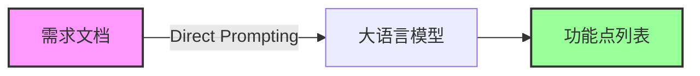
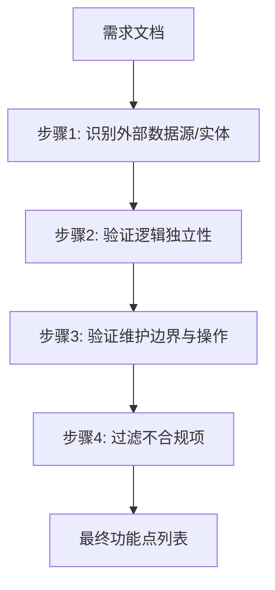
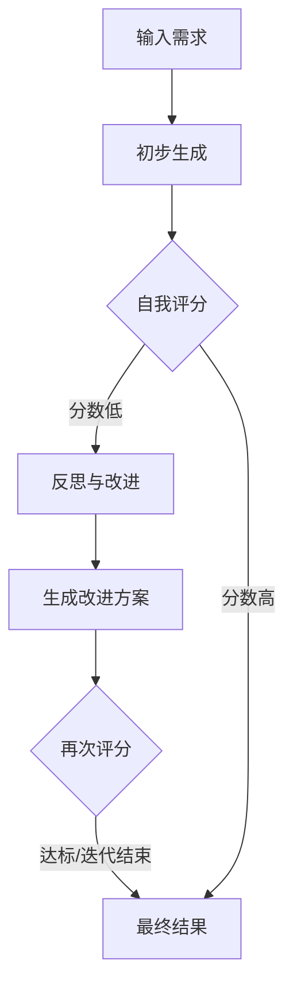

## 3.2 对比基准方法实现 (Implementation of Baseline Methods)

为了全方位、多维度地评估所提出的 GoT 框架在功能点评估任务中的性能表现与实际效用，本研究精心构建了一个包含三种不同推理范式的基准测试组。这些基准方法分别代表了当前大语言模型在认知推理能力上的三个典型层级：零样本直觉推理、线性逻辑推理以及迭代式搜索推理。我们在实验过程中严格控制了模型参数（如 Temperature、Top-P）与运行环境配置，以消除外部变量的干扰，确保对比实验的公平性与科学严谨性。

### 3.2.1 Input-Output (IO) 标准提示

Input-Output (IO) 方法作为最基础的零样本（Zero-Shot）推理模式，主要用于评估大语言模型仅凭预训练阶段获取的通用知识对 IFPUG 规则的内化程度及其在特定场景下的直接应用能力。在此模式下，我们采取一种“黑盒”式的交互策略，即不提供任何少样本（Few-Shot）示例作为参考，也不通过 Prompt 引导模型展示任何形式的中间推理步骤或思维过程。

具体实现逻辑上，我们将原始的需求文档作为上下文直接输入模型，并施加严格的约束指令，要求其跳过分析过程，仅输出最终的功能点列表。这种处理方式旨在模拟普通用户在缺乏提示工程（Prompt Engineering）技巧时的真实使用场景，从而考察模型在“直觉”层面的表现。其交互流程如下所示：

在 Prompt 的具体构建中，我们通过角色设定（Persona）明确模型的“IFPUG 专家”身份，并直接下达分析指令，要求其识别所有可能的 ILF/EIF 功能点。然而，这种方法的局限性是显而易见的。由于缺乏必要的“思考时间”（即生成中间推理 Token 的过程），模型难以对需求文档中隐晦的细节进行深层加工与逻辑关联。这极易导致模型因注意力分散而遗漏关键功能点，或因错误的联想而产生由于大模型概率生成特性所固有的“幻觉”（Hallucination），从而输出不存在的功能点。

### 3.2.2 Chain of Thought (CoT) 思维链

为了克服 IO 方法在逻辑推理上的短板，我们引入了 Chain of Thought (CoT) 方法。该方法利用了大语言模型涌现出的“思维链”能力，通过在 Prompt 中显式要求模型输出详细的推导过程，强制模型将复杂的非结构化需求分析任务分解为一系列有序的线性步骤。在功能点识别的具体实践中，我们将人类专家的分析思维内化为了 Prompt 中的具体指令序列，引导模型逐步深入。

实现逻辑方面，我们将推理过程被精细化拆解为“实体识别”、“属性验证”与“结论判定”三个紧密相连的阶段。模型首先被要求扫描文档并列出所有潜在的数据实体，随后依据 IFPUG 规则逐一验证每个实体是否满足逻辑独立性、边界外存储等关键条件，最后基于验证结果生成洁净的功能点列表。这一流水线过程如下图所示：

我们的 Prompt 设计采用了逐步引导的策略，指令模型先识别外部数据源，再判断其逻辑独立性和维护归属权，最后才得出结论。相比 IO 方法，CoT 显著降低了因逻辑跳跃而导致的错误率，并大幅提升了评估结果的可解释性。然而，CoT 方法的根本缺陷在于其推理路径的**单向性与不可逆性**。一旦模型在第一步实体识别阶段遗漏了某个关键实体，或者在第二步属性验证阶段做出了错误的二元判断，后续的步骤将无法感知并纠正这一前置错误。这种“错误传播”（Error Propagation）效应使得 CoT 在处理长文档或高复杂度需求时，往往显得力不从心。

### 3.2.3 Tree of Thoughts (ToT) 思维树

针对 CoT 在单向推理中无法回溯的问题，我们进一步实现了引入“生成-评估-搜索”机制的 Tree of Thoughts (ToT) 方法。不同于 CoT 的单次线性通过，ToT 允许模型在推理空间中探索多条可能的路径，或对单一路径进行多轮自我反思与修正。在本次实验中，我们采用了一种更符合功能点评估流程的线性迭代变体，即遵循 **“生成 $\rightarrow$ 评分 $\rightarrow$ 优选 $\rightarrow$ 改进”** 的循环模式。

其核心实现逻辑始于模型生成一个初始的功能点候选列表。随后，系统进入迭代循环：首先是 **Generate** 阶段，模型基于当前结果尝试生成更完善的方案；紧接着是 **Score** 阶段，模型被要求自我评估当前方案的完整性与准确性，识别潜在的错漏；在 **KeepBest** 阶段，系统保留得分最高的方案作为下一轮的基础；最后是 **Improve** 阶段，模型针对识别出的弱点（如遗漏的 EIF 或误判的内部数据）进行针对性修正。

在 Prompt 设计中，我们引导模型基于上一轮的分析结果及其自我反思进行改进，重新验证 ILF/EIF 的三要素。ToT 方法凭借其迭代优化的特性，展现出了一定的自我纠错能力，能够有效减少明显的疏漏。然而，它仍然存在局限性：由于缺乏外部视角的引入，ToT 容易陷入**单一维度的思维定势**。例如，如果模型在初始阶段就错误地理解了某个业务概念，单纯的自我反思往往难以跳出这一认知误区（即“不识庐山真面目”），且缺乏如业务视角与技术视角之间的交叉验证机制。这正是本文提出的 GoT 框架试图通过多视角协同推理来解决的核心痛点。
