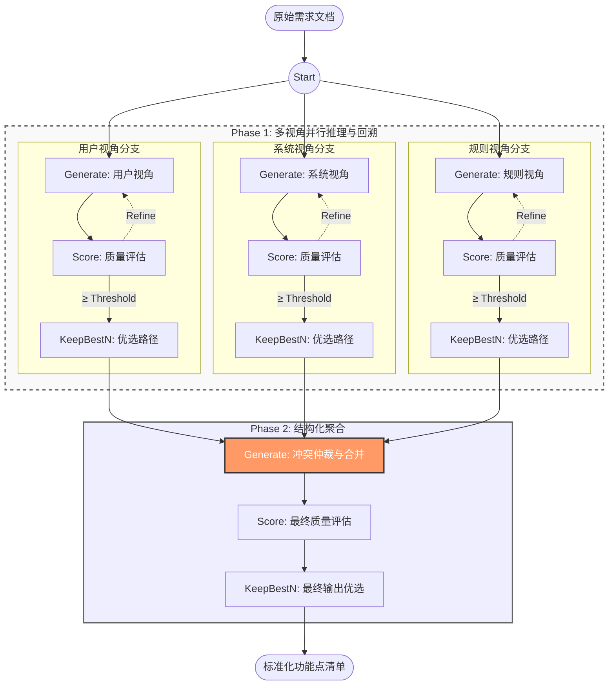
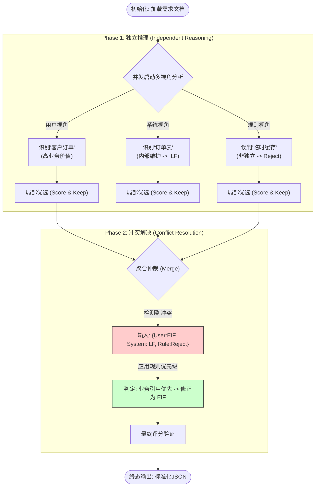

## 3.3 Graph of Thoughts (GoT) 图结构设计

为了有效解决 IFPUG 功能点识别过程中面临的逻辑判断复杂性与多源信息整合难题，本研究创新性地设计了一个基于有向无环图（DAG）的 Graph of Thoughts (GoT) 拓扑结构。该结构超越了传统方法的线性堆叠模式，通过引入并行化的多视角推理分支与动态聚合节点，构建了一个包含“分治-验证-归并”三个核心阶段的高级认知流程，实现了对复杂需求分析过程的深度模拟。

### 3.3.1 拓扑结构与图定义 (Topology & Graph Definition)

本研究提出的 GoT 架构在形式上被定义为一个元组 $G = (V, E)$，其中 $V$ 代表推理状态（Thoughts），即某一分析阶段的中间结果；$E$ 代表状态之间的依赖关系与转换操作。在代码实现层面，该结构依托于 `GraphOfOperations` 类，其内部逻辑被划分为三个核心层次：并行分析层、反馈修正层与聚合决策层。

**并行分析层 (Parallel Analysis Layer)** 的设计初衷在于避免单一视角可能产生的认知偏差。我们在这一层并行初始化了三个独立的 `Generate` 操作节点，分别对应“用户视角”、“系统视角”和“IFPUG规则视角”。

**反馈修正层 (Feedback & Refinement Layer)** 是本框架区别于传统思维链的关键。当并行分支中的中间推理结果在 `Score` 节点未达到预设的置信度阈值时，系统不会简单地丢弃该路径，而是触发回溯机制，将评估意见作为反馈信号输入回 `Generate` 节点。这种“生成-评估-再生成”的迭代循环允许模型自我修正幻觉或逻辑漏洞。

**聚合决策层 (Aggregation & Decision Layer)** 则负责接收来自并行层的输出。所有分支的分析结果最终汇聚于唯一的 `Merge` 节点，该节点不仅承担着信息的物理合并任务，更是解决逻辑冲突的关键仲裁场。随后的 `Final Score` 和 `Final Keep` 节点进一步对合并后的结果进行严格的一致性校验，确保最终输出的功能点列表在逻辑上自洽且符合标准。

具体的图拓扑逻辑如下所示：

### 3.3.2 核心操作算子具体实现 (Implementation of Core Operations)

我们在 `graph_of_thoughts.operations` 基础模块之上，针对功能点识别任务的特性，深度定制了三个支持回溯的核心算子：

#### 1. Generate (生成算子与状态注入)
`Generate` 算子是思维扩展的引擎。在本架构中，如果不加区分地使用同一个 Prompt，并行结构将失去意义。因此，我们在实现中通过 `initial_state` 参数实现了**状态注入**。更为重要的是，该算子被设计为支持**上下文反馈**：当接收到来自 `Score` 算子的回溯请求时，它能够读取之前的错误输出及评分理由，并在新的 Prompt 中加入“反思指令”（Reflective Instruction），从而进行有针对性的修正生成。

#### 2. Score (评分算子与回溯触发)
`Score` 算子不仅用于量化思维路径的质量，更是流程控制的“闸门”。
*   **混合评分机制**：对于中间节点，主要评估逻辑的完备性；对于 eif_selection 任务，引入基于 LLM 的语义一致性评分。
*   **回溯触发逻辑**：系统设定了双重阈值。若得分高于 $T_{high}$（如 0.8），路径进入 `KeepBestN`；若得分低于 $T_{high}$ 但高于 $T_{low}$（如 0.4），算子将触发 `RETRY` 信号，并将当前思维状态回传至上一级的 `Generate` 节点进行自我改进，而非直接丢弃。

#### 3. KeepBestN (优选算子)
尽管 GoT 允许分支发散和回溯，但无限的迭代会导致计算资源的浪费。`KeepBestN` 算子通过贪婪策略控制计算复杂度：在每一层的末尾，系统在进入下一阶段前，强制只保留得分最高的一条思维路径。这一机制确保了 Merge 节点接收到的始终是各视角下经反复打磨后质量最优的分析报告。
### 3.3.3 动态执行流程 (Dynamic Execution Flow)

系统的实际执行流程展现为一个严密的闭环。从初始化加载需求文档开始，控制层并发激活三个视角的 Generate 操作。在独立推理阶段，不同分支分别捕捉到了不同的关键信息：用户分支识别出了具有高业务价值的“客户订单”，系统分支将其定义为内部维护的“订单表”这一 ILF 实体，而规则分支则可能将其误判为非独立的“临时缓存”予以驳回。随后，各分支通过局部优选过滤掉低质量的幻觉输出。当这些存在潜在冲突的结果（如 {User: EIF, System: ILF, Rule: Reject}）汇聚到 Merge 节点时，LLM 基于预设的冲突解决策略进行仲裁，判定“订单表”虽在内部有表结构，但业务上属于外部引用，最终将其修正为 EIF。经过最终评分确认无误后，系统输出标准化的 JSON 格式功能点列表，完成了从模糊需求到精确度量的全过程。

该流程的具体可视化如下图所示：

