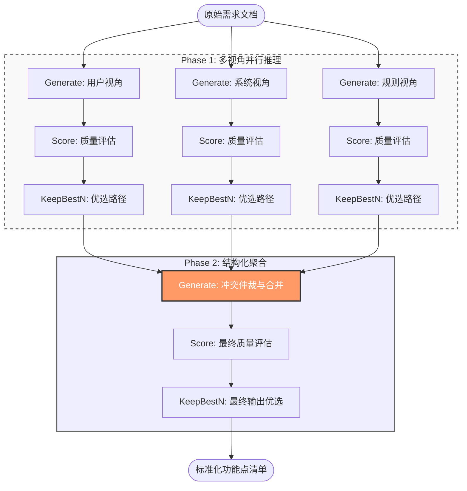

## 3.3 Graph of Thoughts (GoT) 图结构设计

为了解决 IFPUG 功能点识别中复杂的逻辑判断与多源信息整合问题，我们设计了一个基于有向无环图（DAG）的 Graph of Thoughts (GoT) 拓扑结构。该结构并非简单的线性堆叠，而是通过并行的多视角推理分支与动态聚合节点，实现了“分治-验证-归并”的高级认知流程。

### 3.3.1 拓扑结构与图定义 (Topology & Graph Definition)

我们的 GoT 架构形式化为一个元组 $G = (V, E)$，其中 $V$ 代表推理状态（Thoughts），$E$ 代表依赖关系。该结构在代码层面通过 `GraphOfOperations` 类实现，具体包含两条核心路径：

1.  **并行分析层 (Parallel Analysis Layer)**：
    *   为了避免单一视角的认知偏差，我们并行初始化了三个 `Generate` 操作节点，分别对应“用户视角”、“系统视角”和“IFPUG规则视角”。
    *   每个分支独立运行，拥有独立的上下文和 Prompt 模板（详见 3.4 节），互不干扰。这模拟了专家评审会议中不同角色的独立预审过程。

2.  **聚合决策层 (Aggregation & Decision Layer)**：
    *   所有并行分支的输出最终汇聚于唯一的 `Merge` 节点。该节点不仅是信息的物理合并，更是逻辑冲突的仲裁场。
    *   后续连接 `Final Score` 和 `Final Keep` 节点，确保最终输出的功能点列表经过了严格的一致性校验。

具体的图拓扑逻辑如下所示：

### 3.3.2 核心操作算子具体实现 (Implementation of Core Operations)

我们在 `graph_of_thoughts.operations` 模块的基础上，针对功能点识别任务定制了三个核心算子：

#### 1. Generate (生成算子)
`Generate` 算子是思维扩展的核心。在本架构中，如果不加区分地使用同一个 Prompt，并行结构将失去意义。因此，我们在实现中通过 `initial_state` 参数实现了**状态注入**：

*   **Phase 1 (Analysis)**：在初始化三个并行 Generate 节点时，我们分别注入了 `{perspective: "用户视角"}`, `{perspective: "系统视角"}`, `{perspective: "IFPUG规则视角"}`。`FunctionPointPrompter` 接收到这些状态后，会动态加载对应的 Perspective Prompt，引导 LLM 进入特定的分析模式。
*   **Phase 2 (Merge)**：在合并节点，我们注入 `{phase: "merge"}` 状态。此时，LLM 不再进行发散性思考，而是执行 `merge_prompt` 定义的逻辑：检查各视角的一致性，通过多数表决或规则仲裁来解决 User vs System 的视冲突。

#### 2. Score (评分算子)
`Score` 算子用于量化思维路径的质量，是防止错误累积的关键防火墙。
*   **输入**：当前生成的候选功能点列表及完整的推理链条。
*   **评分函数 (`score_assessment`)**：我们实现了一个混合评分机制。
    *   对于中间节点，主要评估逻辑的完备性（是否包含三要素分析）。
    *   对于 eif_selection 任务，我们引入了基于 LLM 的 **语义一致性评分 (Semantic Similarity)**。系统不进行简单的字符串比对，而是计算生成结果与 IFPUG 标准定义的语义距离（0.0 - 1.0）。
*   **阈值控制**：只有得分高于动态阈值（实验中设为 0.8 或 F1-Score 基准）的路径才能通过筛选。

#### 3. KeepBestN (优选算子)
虽然 GoT 允许分支发散，但无限发散会导致组合爆炸。`KeepBestN` 算子通过贪婪策略控制计算复杂度：
*   **参数配置**：在每一层的末尾，我们均应用 `KeepBestN(1, True)`。这意味着无论每个 Generate 节点采样了多少次（`num_branches`），系统在进入下一阶段前，**强制**只保留得分最高的一条思维路径。
*   **作用**：这确保了 Merge 节点接收到的始终是各视角下质量最优的分析报告，极大地提高了聚合阶段的信噪比。

### 3.3.3 动态执行流程 (Dynamic Execution Flow)

系统的实际执行流程如下：
1.  **初始化**：加载需求文档文本。
2.  **并发启动**：Controller 同时激活三个视角的 Generate 操作。
3.  **独立推理**：
    *   Branch 1 (用户): 识别出 "客户订单"（高业务价值）。
    *   Branch 2 (系统): 识别出 "订单表"（内部维护 -> ILF）。
    *   Branch 3 (规则): 识别出 "临时缓存"（非独立 -> 排查）。
4.  **局部优选**：各分支通过 Score -> KeepBestN 过滤掉低质量的幻觉输出。
5.  **全局聚合**：Merge 节点读取到 {User: EIF, System: ILF, Rule: Reject}。基于冲突解决策略，LLM 判定 "订单表" 虽在内部有表结构，但业务上属于外部引用，最终修正为 EIF。
6.  **终态输出**：经过最终评分确认无误后，输出 JSON 格式的标准功能点列表。
