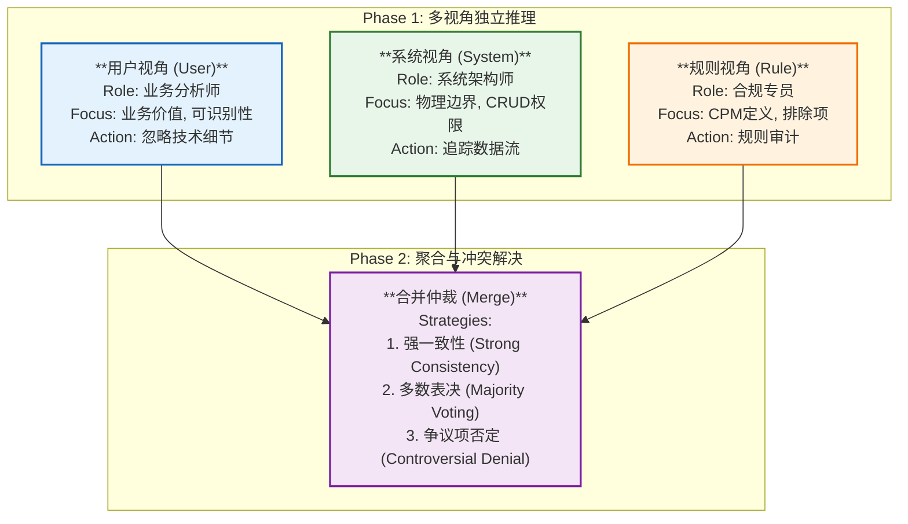

## 3.4 多视角协同分析机制 (Multi-Perspective Mechanism)

GoT 框架的核心优势在于其能够模拟人类专家组“独立评审-集中讨论-共识达成”的决策模式。针对单一 Prompt 在复杂需求分析中容易陷入技术细节或忽略业务语义的局限性，本研究构建了三个互补的分析视角：用户视角、系统视角与 IFPUG 规则视角。每个视角均配备了定制化的思维“卡片”（Prompt Template），旨在从不同维度对同一需求进行全方位的解构与剖析。

**图 3-4: 多视角 Prompt 协同架构设计**

### 3.4.1 用户视角 (User Perspective)

**用户视角**旨在模拟业务分析师（Business Analyst）的思维模式。在此视角下，模型被明确指示剥离底层的数据存储位置或技术格式信息，转而聚焦于数据的业务语义。其核心逻辑在于**业务价值优先**：首先判断数据组是否承载了独立、完整的业务信息（例如“客户名单”），从而区别于仅服务于程序运行的中间状态（例如“Session ID”）；其次验证**用户可识别性**（User Recognizability），即确认终端用户在日常业务操作中能否直观地感知并区分该数据实体。

**用户可识别性**（User Recognizability），即确认终端用户在日常业务操作中能否直观地感知并区分该数据实体。

### 3.4.2 系统视角 (System Perspective)

**系统视角**则模拟了系统架构师（System Architect）的审视角度，重点关注应用的物理边界（Application Boundary）与数据流向，以此作为区分 ILF 与 EIF 的关键技术依据。该视角的推理逻辑主要包含两个维度：首先是**边界判定**，明确数据是驻留在应用内部数据库，还是必须通过 API 或文件接口从外部系统获取；其次是**维护权检查**，对于 ILF，模型需确认应用是否对其拥有完整的 CRUD（增删改查）控制权并负责维护数据一致性；对于 EIF，则重点核实数据是否仅被当前应用“只读引用”（Read-Only Reference），且其维护主体位于应用边界之外。

对于 EIF，则重点核实数据是否仅被当前应用“只读引用”（Read-Only Reference），且其维护主体位于应用边界之外。

### 3.4.3 IFPUG 规则视角 (IFPUG Rules Perspective)

**IFPUG 规则视角**扮演着质量合规专员（Compliance Auditor）的角色，严格对照《IFPUG 计数实践手册 (CPM)》中的定义条款，充当整个评估流程的“过滤器”。在推理过程中，模型首先执行**定义审计**，逐条核对候选实体是否满足 ILF/EIF 的所有必要条件，如必须是逻辑上的一组数据而非单一字段。同时，该视角负责执行严格的**例外排除**机制，主动识别并剔除临时文件（Temporary Files）、索引文件（Index Files）、工作数据（Work Data）以及硬编码数据等非功能点实体，确保评估结果的合规性。

同时，该视角负责执行严格的**例外排除**机制，主动识别并剔除临时文件（Temporary Files）、索引文件（Index Files）、工作数据（Work Data）以及硬编码数据等非功能点实体，确保评估结果的合规性。

### 3.4.4 结果聚合与冲突解决 (Aggregation & Conflict Resolution)

在 GoT 的合并节点，系统接收来自上述三个视角的候选列表与分析理由。为了有效处理多视角间可能存在的认知偏差与结果不一致，本研究设计了一套分级聚合与冲突仲裁机制。

在 GoT 的合并节点，系统接收来自上述三个视角的候选列表与分析理由。为了有效处理多视角间可能存在的认知偏差与结果不一致，本研究设计了一套分级聚合与冲突仲裁机制。

**冲突仲裁机制**：
首先是**强一致性保留 (Strong Consistency)**：当用户、系统及规则三个视角均识别出同一功能点时，该结果被视为具有最高置信度，直接判定为有效。
其次是**多数表决 (Majority Voting)**：当仅有两个视角达成共识（例如用户与规则视角识别为 EIF，但系统视角误判为 ILF）时，模型倾向于保留该结果，但会触发反证逻辑，要求系统视角重新检查是否存在“写操作”证据以修正误判。
最后是**争议项否定 (Controversial Denial)**：对于仅被单一视角识别的孤立项（例如仅用户视角认为有价值，但技术与规则视角均判定为内部临时数据），系统默认将其判定为无效，除非该视角能提供极强的业务证据证明其独立性。通过这种“多方会审”机制，GoT 有效规避了单一视角下的“幻觉”与“盲区”，显著提升了功能点识别的 F1 分数。
