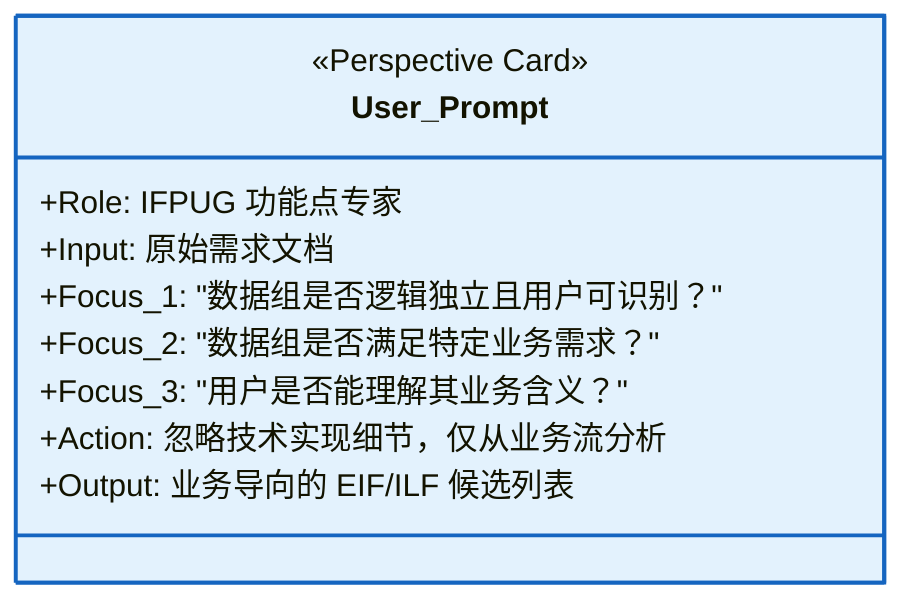
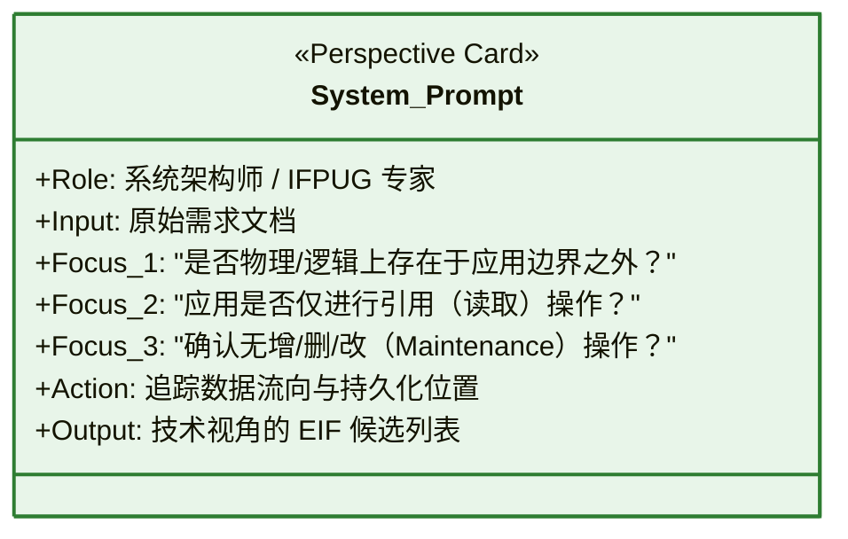
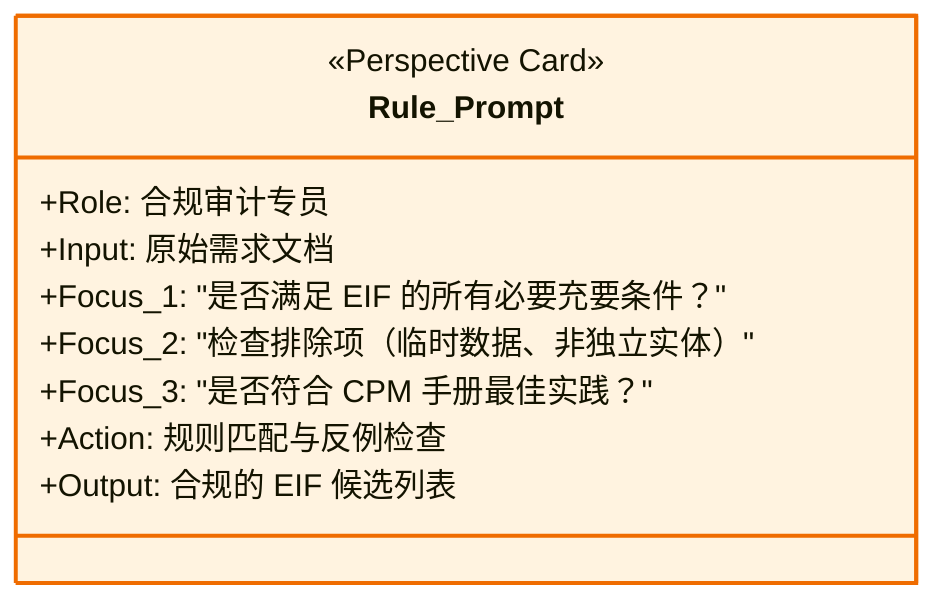
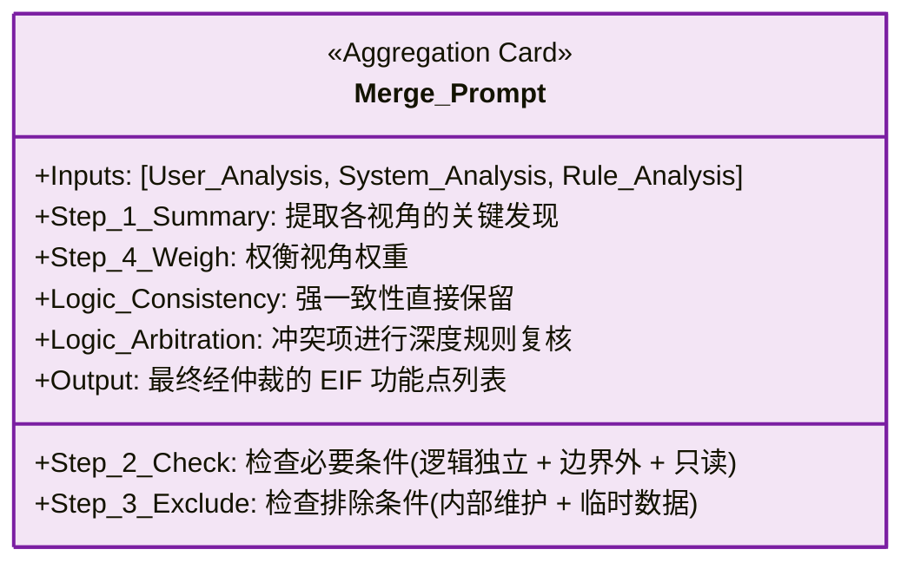

## 3.4 多视角协同分析机制 (Multi-Perspective Mechanism)

GoT 的核心优势在于模拟人类专家组的“独立评审-集中讨论”模式。为了克服单一 Prompt 容易陷入某种特定思维定势（如过分关注技术实现而忽略业务含义）的缺陷，我们设计了三个互补的分析视角。每个视角都配备了专门设计的 Prompt 模板，被封装为独立的思维“卡片”。

### 3.4.1 用户视角 (User Perspective)

用户视角模拟了业务分析师的角色。在此视角下，模型被指示忽略底层的存储位置或技术格式，转而聚焦于数据的业务语义。

*   **核心逻辑**：
    1.  **业务价值优先**：判断该数据组是否承载了独立、完整的业务信息（例如“客户名单”），而非系统生成的中间状态（例如“Session ID”）。
    2.  **用户可识别性 (User Recognizability)**：验证用户是否在日常业务操作中能够感知并区分该数据。

*   **Prompt 结构卡片**：

### 3.4.2 系统视角 (System Perspective)

系统视角模拟了系统架构师的角色。该视角关注应用的物理边界（Application Boundary）和数据流向，这是区分 ILF（内部逻辑文件）和 EIF（外部接口文件）的关键技术依据。

*   **核心逻辑**：
    1.  **边界判定**：明确数据是驻留在应用内部数据库，还是必须通过接口（API/文件）从外部系统获取。
    2.  **维护权检查**：
        *   **ILF**：主要关注是否存在完整的 CRUD（增删改查）流程，且由当前应用负责维护数据一致性。
        *   **EIF**：主要关注数据是否为“只读引用”（Read-Only Reference），且维护主体位于应用边界之外。

*   **Prompt 结构卡片**：

### 3.4.3 IFPUG 规则视角 (IFPUG Rules Perspective)

规则视角模拟了质量合规专员的角色。该视角严格对照《IFPUG 计数实践手册 (CPM)》中的定义条款，充当“过滤器”的角色。

*   **核心逻辑**：
    1.  **定义审计**：逐条核对 CPM 中关于 ILF/EIF 的必要条件（如：必须是逻辑上的一组数据，而非单一字段；必须是用户可识别的）。
    2.  **例外排除**：主动识别并剔除常见的非功能点实体，如：
        *   临时文件 (Temporary Files)
        *   索引文件 (Index Files)
        *   工作数据 (Work Data)
        *   转换后的静态编码 (Hard-coded Data)

*   **Prompt 结构卡片**：

### 3.4.4 结果聚合与冲突解决 (Aggregation & Conflict Resolution)

在 GoT 的合并节点，系统接收来自上述三个视角的候选列表与分析理由。为了处理视角间的不一致，我们设计了分级聚合逻辑。

*   **Prompt 结构卡片**：

*   **冲突仲裁机制**：
    1.  **强一致性保留 (Strong Consistency)**：若 $set(User) \cap set(System) \cap set(Rule)$ 均包含某功能点，直接判定为有效，置信度最高。
    2.  **多数表决 (Majority Voting)**：若仅两个视角识别出（例如 User+Rule 识别为 EIF，但 System 误判为 ILF），模型将倾向于保留，但会要求 System 视角提供“反证”——即检查是否存在“写操作”证据。
    3.  **争议项否定 (Controversial Denial)**：若仅单视角识别（例如仅 User 认为有价值，但 System 和 Rule 均判定为内部临时数据），通常判定为无效，除非该视角能提供极强的业务证据证明其独立性。

通过这种“多方会审”的机制，GoT 有效地解决了单一视角下的“幻觉”与“盲区”问题，显著提升了功能点识别的 F1 分数。
