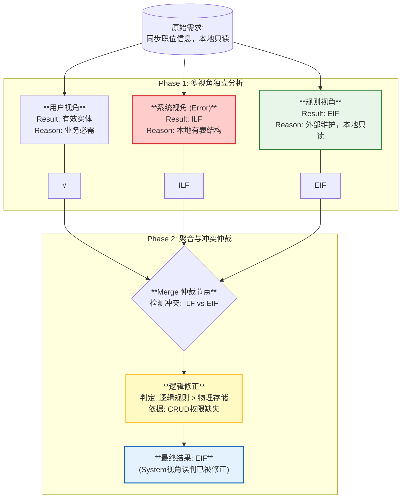

## 3.6 案例分析：人力资源系统职位信息识别 (Case Study: Identification of Position Information in HR Systems)

为了具体展示 GoT 框架在处理模糊需求与解决视角冲突方面的优势，本节将深入剖析一个来自实际企业级项目的典型案例——“人力资源管理系统”中关于“职位信息”同步的需求分析过程。该案例直观地揭示了 GoT 如何通过动态聚合机制修正单一技术视角的误判，从而确保功能点计数的准确性。

### 3.6.1 场景背景与需求定义 (Scenario & Requirement Definition)

在企业应用集成（EAI）场景中，数据的归属权与维护方式往往是功能点分类（ILF vs EIF）的模糊地带。本案例选取了一条看似简单但极易混淆的需求描述：

> **原始需求**：“本系统需从集团主数据系统（MDM）同步‘职位信息’，以便在员工入职流程中进行调用。本地系统只能查看职位列表，不能修改任何职位数据。”

针对这一需求，传统的单链推理模型（如 CoT）往往容易陷入“本地存储即 ILF”的思维定势，或者忽略“只读”约束的重要性。我们将展示 GoT 框架如何通过多视角协同来破解这一难题。

### 3.6.2 多视角独立推理过程 (Multi-Perspective Independent Reasoning)

在推理的初始阶段（Phase 1），三个并行运行的视角基于各自的 Prompt 模板对需求进行了独立的解构与分析：

1.  **用户视角 (User Perspective)**：
    业务分析师重点关注数据的业务价值。分析模型识别出“职位信息”是业务流程（员工入职）中不可或缺的独立业务实体，具有明确的**用户可识别性**。因此，用户视角将其标记为有效的“功能候选项（Candidate Function）”，但不涉及具体的类型分类（ILF/EIF）。

2.  **系统视角 (System Perspective)**：
    系统架构师关注数据的物理落地。模型捕捉到“同步”一词，推断本地数据库中必然存在一张对应的“职位表”以支撑查询。受限于技术视角的惯性，模型依据“本地存在物理表结构”这一特征，错误地将其初步判定为 **ILF (内部逻辑文件)**，忽视了 CRUD 权限的缺失。

3.  **规则视角 (IFPUG Rules Perspective)**：
    合规专员严格对照 CPM 手册。模型敏锐地捕捉到了“不能修改”和“从...同步”这两个关键词，判定该数据组完全由外部系统（集团 MDM）维护，且本地应用仅拥有“读取权”。依据 IFPUG 定义，这完全符合 **EIF (外部接口文件)** 的充要条件。

### 3.6.3 冲突检测与动态修正 (Conflict Detection & Dynamic Correction)

当 Phase 1 的结果汇聚至 **Merge 节点** 时，系统检测到了显著的认知冲突：
*   **输入向量**：`{User: 有效功能点, System: ILF (Misjudgment), Rule: EIF}`

针对这一冲突，GoT 的聚合层触发了预设的仲裁逻辑（Arbitration Logic）：
*   **证据加权**：模型对比了 System 视角与 Rule 视角的论据。System 视角的依据是隐式的“物理存储推断”，而 Rule 视角的依据是显式的“业务规则约束（只读）”。
*   **规则压制**：依据 IFPUG 的高阶原则——“逻辑视图优于物理实现”，Merge 节点判定 Rule 视角的证据效力高于 System 视角。即便是本地有一张物理表，只要其数据维护源在外部且本地只读，逻辑上仍应归类为 EIF。

最终，GoT 系统成功驳回了 System 视角的 ILF 结论，采纳了 Rule 视角的 EIF 结论，并输出最终的标准化功能点清单。

下图完整展示了该案例中从独立推理到冲突解决的全过程：

此案例有力地证明了，相较于容易被单一技术细节误导的线性推理模型，GoT 框架通过引入多视角的交叉验证机制，能够显著提升对复杂业务规则的解析精度，有效避免了高代价的评估错误。
