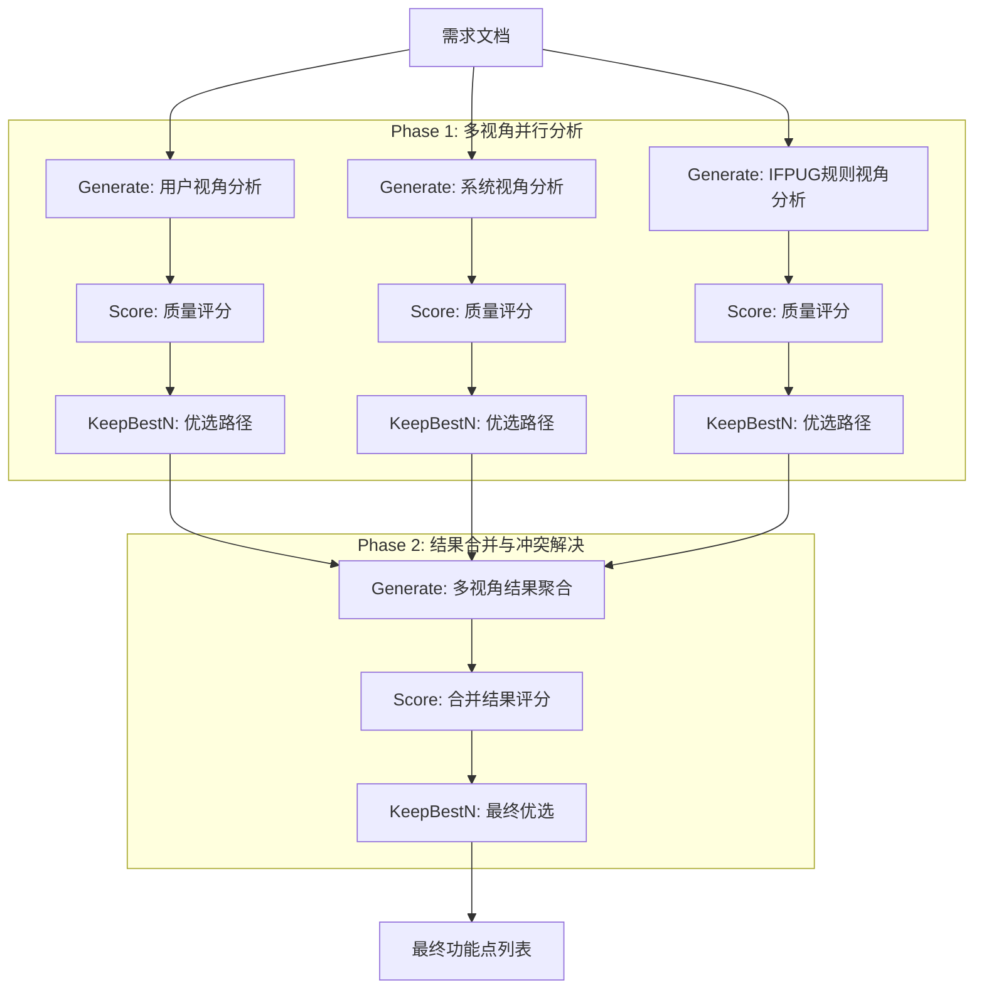

## 3.3 Graph of Thoughts (GoT) 图结构设计

针对 ILF 和 EIF 识别任务的高复杂性，我们设计了特定的 GoT 拓扑结构，旨在通过多视角并发推理和结构化聚合来超越上述基准方法。该结构基于 `GraphOfOperations` 类实现，包含三个主要阶段：并行分析阶段 (Parallel Analysis Phase)、合并阶段 (Merge Phase) 和 最终决策阶段 (Final Decision Phase)。

### 3.3.1 拓扑结构 (Topology)
我们的 GoT 结构如图 3.1 所示，采用“分治-聚合”策略。



### 3.3.2 核心操作算子 (Core Operations Implementation)
我们在框架中定义了以下关键操作算子，每个算子对应代码中的具体实现逻辑：

1.  **Generate (生成操作)**：
    *   **Phase 1 (Analysis)**：并发启动三个 `Generate` 操作，`num_branches=1`。代码中通过 `initial_state` 分别注入 `perspective` 参数（"用户视角"、"系统视角"、"IFPUG规则视角"）。这将动态调用 `FunctionPointPrompter.perspective_prompt`，确保模型分别聚焦于“业务价值”、“系统边界”和“合规定义”。
    *   **Phase 2 (Merge)**：输入三个视角的优选结果，调用 `Generate` 操作并设置 `phase="merge"`。此时系统调用 `merge_prompt`，引导 LLM 对三个视角的发现进行一致性检查（Consistency Check）和冲突解决（Conflict Resolution），生成合并后的唯一功能点列表。

2.  **Score (评分操作)**：
    *   该算子负责对每个生成的思维状态（Thought State）进行质量打分。
    *   **实现机制**：在 `eif_selection` 任务中，我们引入了 `score_assessment` 函数，该函数支持基于 LLM 的语义相似度评分（Semantic Scoring）。对于生成的候选功能点列表，系统计算其与标准定义的匹配度（F1 Score 或 0-1 二值评分）。
    *   **作用**：评分低于阈值的推理路径将被标记为低质量，为后续的剪枝操作提供依据。

3.  **KeepBestN (优选操作)**：
    *   **动态剪枝**：在每一层级（Line of Operations）后应用 `KeepBestN(1, True)` 算子。这意味着对于每个视角，无论生成了多少候选分析，我们仅保留得分最高的那条思维路径（Best Thought Path）。
    *   **资源优化**：在合并阶段前，通过 KeepBestN 过滤掉逻辑混乱或明显错误的单视角分析，确保聚合节点（Merge Node）仅处理高质量的输入信息，最大化计算资源的利用效率。

## 3.4 多视角协同分析机制 (Multi-Perspective Mechanism)

GoT 的核心优势在于模拟人类专家组的“独立评审-集中讨论”模式。我们在 Prompt 中明确了各视角的关注点（Attention Focus）：

### 3.4.1 用户视角 (User Perspective)
*   **关注点**：业务价值和可识别性。
*   **Prompt 核心指令**：
    > - 数据组是否逻辑上独立且用户可识别
    > - 数据组是否能满足特定的业务需求
    > - 数据组对用户是否有实际业务价值

### 3.4.2 系统视角 (System Perspective)
*   **关注点**：数据维护边界和操作类型。
*   **Prompt 核心指令**：
    > - 数据是否物理/逻辑上存在于应用边界之外
    > - 应用是否仅引用（读取）该数据，不进行增删改操作
    > - 数据是否由其他应用或系统维护

### 3.4.3 IFPUG 规则视角 (IFPUG Rules Perspective)
*   **关注点**：定义符合度和排除条件。
*   **Prompt 核心指令**：
    > - 是否满足EIF的所有必要条件（逻辑独立、外部存储、只读引用）
    > - 是否存在反例或例外情况
    > - 是否符合IFPUG的最佳实践

### 3.4.4 结果聚合与冲突解决 (Aggregation & Conflict Resolution)
在聚合节点（Merge Node），LLM 充当“主审”角色，接收来自上述三个视角的分析报告。聚合逻辑如下：
1.  **强一致性保留**：三个视角均识别出的功能点直接保留。
2.  **弱一致性校验**：仅两个视角识别出的，通过多数表决机制保留，但需简要说明理由。
3.  **冲突仲裁**：仅一个视角识别出的功能点被标记为“争议项”。LLM 会针对性地检查该项是否存在“临时数据”、“非独立实体”等排除特征，进行二次判断。

**Merge Prompt 示例**：
```text
请综合以下三个视角的分析结果...
[分析要求]
1. 必须同时满足以下所有条件才能判定...
2. 存在以下任一情况就不能判定...
[分析步骤]
1. 分别总结各视角的关键发现
2. 检查是否满足所有必要条件
3. ...
```

## 3.5 评估指标与语义匹配 (Evaluation Metrics & Semantic Matching)

为了客观评估各方法的性能，我们构建了一套包含语义理解的评估指标体系。

### 3.5.1 基础指标
采用信息检索领域的标准指标：
*   **Precision (精确率)**：预测正确的功能点数 / 预测总数。
*   **Recall (召回率)**：预测正确的功能点数 / 真实功能点总数。
*   **F1 Score**：精确率和召回率的调和平均。

### 3.5.2 基于 LLM 的语义匹配 (LLM-based Semantic Matching)
针对功能点命名不一致问题（如“员工信息” vs “人员档案”），传统的字符串匹配会造成误判。我们引入了语义评分机制：

1.  **精确匹配 (Exact Match)**：基于标准化字符串的比对。
2.  **语义匹配 (Semantic Match)**：对于未命中的项，调用 LLM 判断预测词与标注词的语义一致性。
    *   **Prompt**：
      ```text
      请判断以下两个功能点名称是否指代同一个功能点：
      功能点1: {name1}
      功能点2: {name2}
      请直接回答相似度分数（0.0到1.0之间的小数）。
      ```
    *   **判决**：仅当相似度分数 $> 0.7$ 时，视为正确匹配，并计入 Fuzzy Score。

## 3.6 案例分析 (Case Study)

以“人力资源系统”中的“职位信息”识别为例，展示 GoT 如何修正系统视角的误判。

### 3.6.1 输入需求
> **需求**：系统需从集团主数据系统同步“职位信息”，本地系统只能查看，不能修改。

### 3.6.2 多视角分析
1.  **用户视角**：识别为功能点（有业务价值）。
2.  **系统视角**：**误判**为 ILF（忽略了“不能修改”，误以为本地存储即为内部维护）。
3.  **规则视角**：识别为 EIF（依据“只读”和“外部维护”规则）。

### 3.6.3 聚合修正
Merge 节点接收到 {User: 功能点, System: ILF, Rule: EIF} 的冲突信息。
*   **仲裁过程**：Prompt 引导模型检查“维护”属性。模型注意到规则视角引用的“不能修改”证据，判定系统视角的“ILF”结论错误。
*   **最终结果**：修正为 **EIF**。

此案例表明，GoT 通过多视角交叉验证，有效避免了单链推理中因单一视角偏差导致的错误。
